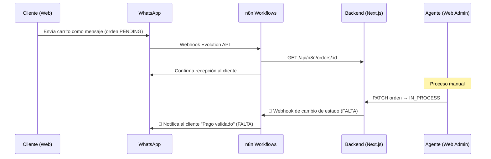
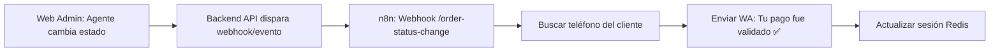
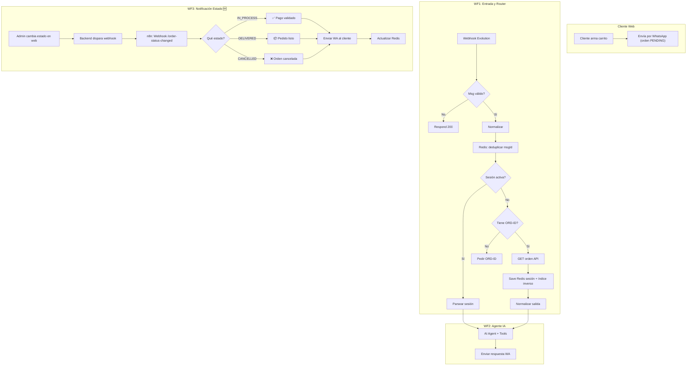

# Análisis de Workflows n8n — Flujo WhatsApp + Órdenes

## Resumen del Flujo Deseado



---

## Lo que YA tienes bien ✅

### Workflow 1: `[WA] Entrada y Router`

| Nodo | Función | Estado |
|------|---------|--------|
| Webhook | Recibe mensajes de Evolution API | ✅ OK |
| Filtrar Mensajes Válidos | Descarta mensajes propios y de protocolo | ✅ OK |
| Normalizar Datos | Extrae phone, message, pushName, msgId | ✅ OK |
| Buscar Sesión (Redis) | Verifica si existe sesión previa en Redis | ✅ OK |
| ¿Sesión Activa? | Bifurca según exista sesión o no | ✅ OK |
| Parsear Sesión | Si ya tiene sesión, la parsea y pasa al Agente IA | ✅ OK |
| Extraer Order ID (Code) | Si no tiene sesión, busca patrón `ORD-XXXXXX` en el mensaje | ✅ OK |
| ¿Tiene Order ID? | Si no lo tiene, le pide al cliente que envíe su ORD | ✅ OK |
| Obtener Datos de la Orden | Consulta el backend por la orden | ✅ OK |
| Guardar sesión (Redis SET) | Persiste la sesión con TTL 24h | ✅ OK |
| Normalizar Salida → Agente IA | Pasa datos al sub-workflow | ✅ OK |
| Respond to Webhook | Responde 200 a Evolution | ✅ OK |

### Workflow 2: `[WA] Agente IA`

| Nodo | Función | Estado |
|------|---------|--------|
| Execute Workflow Trigger | Recibe datos del Router | ✅ OK |
| AI Agent (Ollama qwen2.5:7b) | Procesamiento con LLM local | ✅ OK |
| Postgres Chat Memory | Historial de conversación por teléfono | ✅ OK |
| get_order_details | Tool: consulta detalles de orden | ✅ OK |
| validate_customer_identity | Tool: valida DNI + código | ✅ OK |
| update_order_status | Tool: actualiza estado de orden | ✅ OK |
| modify_order_items | Tool: agrega/elimina items | ✅ OK |
| send_tracking_link | Tool: genera link de seguimiento | ✅ OK |
| HTTP Request → Evolution | Envía respuesta del agente al cliente | ✅ OK |

---

## Lo que FALTA 🔴

### 1. Workflow de Escucha de Cambio de Estado (CRÍTICO)

> [!CAUTION]
> **Este es el eslabón faltante más importante.** No hay ningún mecanismo para que cuando el agente (admin) cambie el estado de la orden a `IN_PROCESS` desde la web admin, n8n se entere y notifique proactivamente al cliente por WhatsApp.

**Necesitas un tercer workflow (o un webhook adicional dentro del Router):**



**Implementación sugerida:**

**a) En tu Backend (Next.js)** — Necesitas un endpoint o lógica que al cambiar el estado:
```typescript
// Cuando el admin actualiza la orden a IN_PROCESS
await fetch('https://tu-n8n-url/webhook/order-status-changed', {
  method: 'POST',
  headers: { 
    'Content-Type': 'application/json',
    'Authorization': 'Bearer TU_WEBHOOK_SECRET' 
  },
  body: JSON.stringify({
    orderId: order.id,
    newStatus: 'IN_PROCESS',
    previousStatus: 'PENDING',
    customerPhone: order.customerPhone,
    customerName: order.customerName,
    total: order.total
  })
});
```

**b) En n8n** — Nuevo workflow `[WA] Notificación de Estado`:
```
1. Webhook Trigger: POST /order-status-changed
2. Validar token de autorización
3. Switch por newStatus:
   - IN_PROCESS → "✅ ¡Hola {nombre}! Tu pago ha sido validado. Tu orden {orderId} está ahora en proceso."
   - DELIVERED_STORE → "📦 Tu pedido {orderId} está listo para recoger en tienda."
   - DELIVERED_DELIVERY → "🚚 Tu pedido {orderId} ha sido enviado. Sigue tu envío aquí: {trackingLink}"
   - CANCELLED → "❌ Tu orden {orderId} ha sido cancelada. Contacta soporte si tienes dudas."
4. Enviar mensaje por Evolution API
5. Actualizar sesión en Redis (si aplica)
6. Respond 200
```

---

### 2. Almacenamiento del Teléfono del Cliente en la Orden (NECESARIO)

> [!IMPORTANT]
> Actualmente la sesión Redis se crea con key `wa_session_{phone}`, pero cuando el admin cambia el estado desde la web, **¿cómo sabe n8n a qué teléfono notificar?**

**Opciones:**
- **Opción A (Recomendada):** Guardar el `customerPhone` como campo en la tabla de órdenes de tu BD. Así cuando el backend dispare el webhook, incluye el teléfono.
- **Opción B:** Buscar en Redis por `orderId` (requiere un índice inverso: `wa_order_{orderId} → phone`).

**Si usas Opción B**, agrega al nodo "Guardar sesión (Redis SET)":
```
Key: wa_order_{{ $json.id }}
Value: {{ phone }}
TTL: 86400
```

---

### 3. Manejo de Errores (IMPORTANTE)

> [!WARNING]
> Ninguno de los dos workflows tiene nodos de manejo de errores. Si falla la API, Redis, u Ollama, el flujo muere silenciosamente.

**Agrega:**
- **Error Workflow global** en n8n settings para capturar errores y logearlos.
- **Try/Catch** alrededor de los nodos HTTP Request (Obtener Datos de la Orden, update_order_status).
- **Mensaje de fallback** al cliente: "Lo sentimos, hubo un error procesando tu solicitud. Un asesor te contactará pronto."

---

### 4. Validación de Webhook Entrante (SEGURIDAD)

> [!WARNING]
> El Webhook de Evolution API no valida ningún token o secreto. Cualquier persona que conozca la URL podría enviar mensajes falsos.

**Agrega validación:**
```javascript
// En un nodo Code después del Webhook
const apiKey = $json.headers['apikey'] || $json.headers['x-api-key'];
if (apiKey !== $env.EVOLUTION_APIKEY) {
  throw new Error('Unauthorized');
}
```

---

### 5. Concurrencia / Deduplicación de Mensajes

> [!NOTE]
> WhatsApp/Evolution puede enviar el mismo mensaje varias veces (retries). Sin deduplicación, el agente podría responder múltiples veces.

**Solución:**
- Guardar `msgId` en Redis con TTL corto (60s).
- Antes de procesar, verificar si `msgId` ya fue procesado.

```
Nodo Redis GET: wa_msg_{msgId}
  → Si existe → Respond 200 (ignorar duplicado)
  → Si no existe → Redis SET wa_msg_{msgId} con TTL 60 → Continuar flujo
```

---

### 6. Actualización de Sesión Redis tras Cambio de Estado

El nodo "Guardar sesión (Redis SET)" guarda `status` al momento de crear la sesión. Si el admin cambia el estado, la sesión Redis queda desactualizada.

**Solución:** En el workflow de notificación de estado (punto 1), actualizar también la sesión Redis:
```
Redis SET: wa_session_{phone}
Value: { ...sessionDataExistente, status: newStatus }
```

---

## Flujo Completo Propuesto



---

## Checklist de Implementación

| # | Tarea | Prioridad | Estado |
|---|-------|-----------|--------|
| 1 | Crear WF3: Notificación de cambio de estado | 🔴 Crítica | Pendiente |
| 2 | Backend: disparar webhook al cambiar estado de orden | 🔴 Crítica | Pendiente |
| 3 | Guardar `customerPhone` en la orden (BD) | 🔴 Crítica | Verificar |
| 4 | Agregar deduplicación de mensajes (msgId en Redis) | 🟡 Alta | Pendiente |
| 5 | Validar token del webhook de Evolution API | 🟡 Alta | Pendiente |
| 6 | Agregar manejo de errores global | 🟡 Alta | Pendiente |
| 7 | Crear índice inverso Redis: `wa_order_{orderId} → phone` | 🟡 Media | Pendiente |
| 8 | Actualizar sesión Redis cuando cambia el estado | 🟡 Media | Pendiente |
| 9 | Agregar mensajes de fallback ante errores | 🟢 Baja | Pendiente |

---

## Observaciones Adicionales

### Sobre el `sessionData` en "Normalizar Salida"
La línea 343 construye el `sessionData` como un string multi-línea en formato YAML-like, no como JSON/objeto válido:
```
orderId: ...,
customerName: ...,
total: ...,
```
Esto podría fallar al intentar acceder como `$json.sessionData.customerName` en el Agente IA. Debería ser un objeto JSON válido, similar a como se hace en "Guardar sesión (Redis SET)" con `JSON.stringify({...})`.

### Sobre el modelo Ollama
Usando `qwen2.5:7b` localmente — asegúrate de que el contexto del system prompt no exceda la ventana de contexto del modelo (típicamente 4-8k tokens para 7B). Con la sesión, historial de chat, y tools, puede quedarse corto en conversaciones largas.
